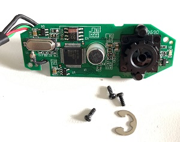
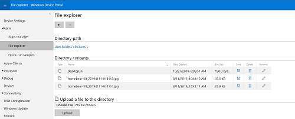
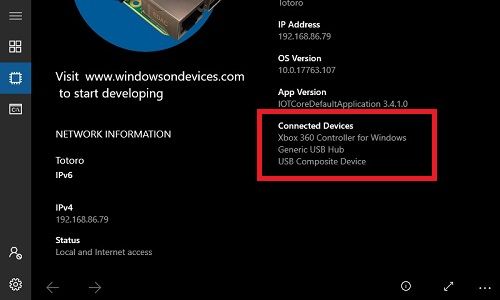

# HomeBear.Tilt

 

> Windows 10 IoT Core UWP app proof-of-concept that works great with the Pimoroni [Pan-Tilt HAT](https://shop.pimoroni.com/products/pan-tilt-hat) (PIC16F1503).

## Build status

|Service|Result|
|-|-|
|Continious integration|[](https://tscholze.visualstudio.com/HomeBear.Tilt/_build/latest?definitionId=6&branchName=master)|
|Static code analyse|[](https://sonarcloud.io/dashboard?id=io.github.tscholze.homebear)|

## Prerequirements
- Windows 10
- Visual Studio 2019
- Raspbbery Pi 3 (B) with [Windows 10 IoT Core](https://developer.microsoft.com/en-us/windows/iot) 17763 or higher
- Pimoroni [Pan-Tilt HAT](https://shop.pimoroni.com/products/pan-tilt-hat)
- (optional) Webcam ([Supported devices](https://docs.microsoft.com/en-us/windows/iot-core/learn-about-hardware/hardwarecompatlist))
- (optional) Wired XBox 360 controller


## How it looks


## Features

### Overview

- [x] Pans
- [x] Tilts
- [x] Camera preview
- [x] Take camera snaphots
- [x] Follows detected faces
- [x] Gamepad support
- [ ] Controls LEDs

### Camera

Windows 10 IoT Core does not support the camera interface of a Raspberry Pi (CSI). I choose a Logitech CS270 HD Webcam ([Amazon](https://www.amazon.de/gp/product/B01BGBJ8Y0)).

The casing had to be removed to make it light enough that the camera will be pan- and tilt-able by the servos.



### Taking camera snapshots

The apps takes on button press snapshots of the current camera preview. The images will be stored in the Pictures library folder of the Windows 10 IoT Core system. 

To access the images from another computer open the Device Portal Website and use the File explorer to download the images.



### Face detection

To detected faces, the app will use the [built-in face detection feature](https://docs.microsoft.com/en-us/windows/uwp/audio-video-camera/scene-analysis-for-media-capture)  of the `Windows.Media.Core` package.

The media capture processing capabilities of a Raspberry Pi 3B seems to be not very performant. The detection is slow but works in good light condition.

### Gamepad support

[According to the Microsoft Technet](https://social.msdn.microsoft.com/Forums/en-US/73389c53-3cfd-43f2-8859-db5e5e8c5eb4/xbox-one-controller-for-windows-10-iot), Windows 10 IoT Core does not work well with the Bluetooth based XBox One gamepad.

The XBox 360 gamepad should work wired or using the Wireless receiver. The receiver lost the connection to the Pi after the app has been started. A USB-wired gamepad works as expected.

### LED controller

To assemble the LED strip I have to learn solidering first. I'll update the app after I earned this skill.

## Usage

Connect all USB devices like the camera or the gamepad to the Pi. Check if all devices are listed at the dashboard "connected.

Start the app from the App Manager or via a Visual Studio debug session.



## Keep in mind

**This a is a learning project**

This is a proof-of-concept app that's purely build for having fun! All features have room for improvements or could harm the hardware.

**Auto. granted permissions and capabilities**

The system will access your web camera, microphone and photo lib capabilities.

```
<Capabilities>
    <Capability Name="internetClient" />
    <uap:Capability Name="picturesLibrary"/>
    <DeviceCapability Name="webcam"/>
    <DeviceCapability Name="microphone"/>
  </Capabilities>
  ```

## Information

Most of the HAT logic is based on the [offical Python libraries](https://github.com/pimoroni/pantilt-hat/blob/master/library/pantilthat/pantilt.py).

## Known issues

- Reading of pan and tilt angles are (slightly) off the actual value.
- The servos sometimes start to buzz quite heavily. 
- The webcam could flicker on the x, y middle.
- The gamepad could be interpreted as touch that selects buttons

## Ideas for the future

- Connect to Azure IoT Hub
- Add Azure Blog Storage for uploading detected faces

## Contributing

Feel free to improve the quality of the code. It would be great to learn more from experienced C#, UWP and IoT developers.

## Authors

Just me, [Tobi]([https://tscholze.github.io).


## Thanks to

* Pimoroni [Discord](https://discordapp.com/invite/hr93ByC) Community
* Stackoverflow User [michael-xu-msft](https://stackoverflow.com/users/8546089/)
* Pimoroni Python [source](https://github.com/pimoroni/pantilt-hat/blob/master/library/pantilthat/pantilt.py)

## License

This project is licensed under the MIT License - see the [LICENSE](LICENSE.md) file for details.
Dependencies or assets maybe licensed differently.
